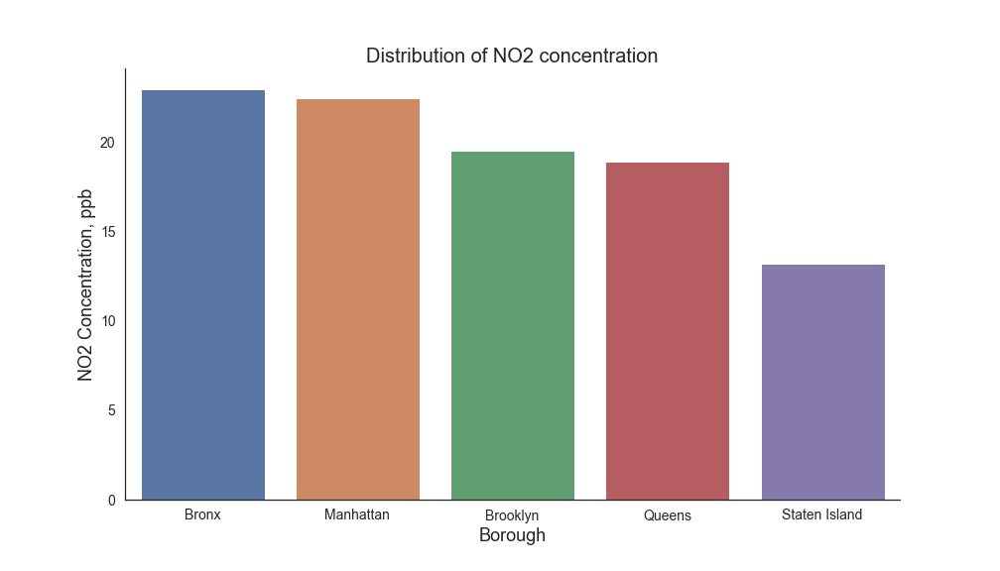

## Introduction

### What is our motivation?
Since we were constrained to have a topic on a city, to be environmentally friendly,
related on social activity, provide a rich data analysis and visualization
and to show applications of machine learning, our search was narrowed considerably.

Nonetheless, we managed to gather a dataset which is a collection of two
data sources for the city of New York. One for air quality and the other for trees in the city. 
The air quality dataset contains information mainly about air quality metrics, geographical position where the measurement was taken,
the date of measurement, and the value of the measurement. These air quality data are collected
based on a neighbourhood index. Trees dataset is wider and contains information about the scientific name
of the trees, their city locations, status (alive, dead, or stump), and other variables. We want to mention that the data gathered
is on trees located around the streets, passages, houses and so on. Sadly, parks are not included in this category,
despite the fact that they account for the highest density and variety of trees and also improve the air quality considerably.
The data was collected in 2015.

Thus, we are following the SDG goals and in particular SDG 15

 
### What would you as a reader experience?

We consider planting trees a social activity. Thus we would like to walk the user through our website to present insights
from our dataset both graphically and analytically. Ultimately, our goal is to provide an elaborate answer to the question:
*What trees should be planted more to improve the air quality in a city, based on data from New York, USA?*

Ok, so let's dive in. 

 

### Exploratory Data Analysis 

#### What are the 10 most polluted neighborhoods and the health distribution of tree species in the neighborhoods?

One may notice that most trees are assessed as good health regardless of the neighborhood. However, we notice that less
polluted regions have more trees in good health condition than more polluted once. Another observation is that less 
polluted regions have significantly more trees overall than the regions with high pollution.

 

#### What are top 10 most numerous species of trees in NYC?

We can observe that London Plant tree, Honey Locust tree and Callery Pear are the three most abundant trees. We will compare
this data later to conclude how much they impact the air quality in comparison to other tree species and if it is a good
to plant more of these species or increase the numbers of others. 

 

#### How is NO2 concentration distributed?

We observe a normal distribution of the NO2 concentration with a mean at 19.4. In general, we see that the air quality is
good across entire New York. 

 

#### Now let us observe the average NO2 concentration in air for each borough

As we can see, Bronx and Manhattan are leading at the NO2 concentration. Staten Island has the cleanest air, as it is
far away from all the traffic and has a bigger fraction of its territory covered by green areas. 

 

#### Number of trees in each borough by health status

In our dataset, trees are categorized in three categories by health status: *good, fair* and *poor*. We would like to check
how are they distributed across all five boroughs.  

 

<iframe  src="trees_boro.html"
	sandbox="allow-same-origin allow-scripts"
	width="100%"
	height="700"
	scrolling="yes"
	allowfullscreen
	seamless="seamless"
	frameborder="0">
</iframe>

 

For all health situations of the trees, we can observe that Brooklyn and Queens have the most trees, it is also explained
by the bigger area that these boroughs cover with bigger parks but also more residential areas with houses. Manhattan, on
the contrary, has the leas amount explained by the fact that there are mostly skyscrapers.
If we take at the fractions of the health, we can observe that most of the trees are in good health with around 75-80% in all boroughs.
Brooklyn and Queens again share the most amount of healthy trees across all healthy trees recorded with 27% each, which
is explained by the amount residential neighborhoods and green areas in general. FOr the fair health, Brooklyn and Queens are predominant
with around 30% each of all fair trees. We can also observe from the data that trees are closely monitored and taken care of, and those in
poor health account to approximately 5% of oll trees in each borough. 

If we compare this plot with the one above it, we can see that the amount of trees is directly impacting the air quality.
For example Bronx and Manhattan have the highest concentrations of NO2 in the air, at the same time have fewer trees
than other boroughs. 

 

#### Let's see how many trees we have in each neighborhood of every borough

 

<iframe  src="trees_neigh.html"
	sandbox="allow-same-origin allow-scripts"
	width="100%"
	height="800"
	scrolling="yes"
	seamless="seamless"
	frameborder="0">
</iframe>

 

If we take a look at all boroughs we can observe that neighbourhoods in Queens and Manhattan are the most balanced with
tree coverage. In Manhattan, Lower Manhattan and Bay Ridge have the least number of trees, and it is explained by the
fact that there are only buildings for offices and residential houses. In Bronx, top 2 neighborhoods are **Clinton and Chelsea and Pelham**.
This is explained by the fact that in those regions there are bigger green areas and more nature. For Staten Island we can observe
a huge difference between South Beach-Tottenville and the rest. It is explained by the fact that there is a huge residential area with
a lot of trees on the streets and around houses.

  

#### Trees distribution on the map 

Below we can see the distribution of all trees in New York. The density of trees varies in colors from more to less - red,
orange, yellow, green, green, blue and purple. Feel free to play around, zoom in, zoom out.  

 <h4>Heatmap for all trees in New York</h4> 

<iframe  src="map_tree_allspec.html"
	sandbox="allow-same-origin allow-scripts"
	width="100%"
	height="500px"
	scrolling="no"
	seamless="seamless"
	frameborder="0">
</iframe>

 

For rest of the analysis we focused on the 10 most abundant tree species. We believed that choosing 10 most abundant will
provide some statistical significance. If there is not enough data, we cannot make "verified" conclusions.
Let us take for example *London Planetree*, *Callery Pear* and *Cherry* and visualize their corresponding heatmaps. 
From these heatmaps we can see, there a high concentration of trees in each individual species, a large number of trees
of a certain species will exist in "clusters" in a certain part of the city, rather than mixing with other tree species.

 <h4>Heatmap for London Planetree in New York</h4> 

<iframe  src="map_tree_London_planetree.html"
	sandbox="allow-same-origin allow-scripts"
	width="100%"
	height="500px"
	scrolling="no"
	seamless="seamless"
	frameborder="0">
</iframe>

 

London Planetree is the most abundant out of all species in New York and has the highest densities in Brooklyn and Staten Island. 
 

 <h4>Heatmap for Callery Pear in New York</h4> 

<iframe src="map_tree_Callery_pear.html"
	sandbox="allow-same-origin allow-scripts"
	width="100%"
	height="500px"
	scrolling="no"
	seamless="seamless"
	frameborder="0">
</iframe>

This species has the highest density in the southwest past of New York, Staten Island 
 

 <h4>Heatmap for Cherry trees in New York</h4> 

<iframe src="map_tree_cherry.html"
	sandbox="allow-same-origin allow-scripts"
	width="100%"
	height="500px"
	scrolling="no"
	seamless="seamless"
	frameborder="0">
</iframe>

In general, if we look at the numbers, cherry trees are not so abundant compared to other species. However, most of them
appear to be located in hotspots for example in the eastern Brooklyn.
 

Fortunately, these clusters of high density of a particular species gives us a good basis for studying the effects of 
different species on air quality. We will be able to observe which species in particular purify the air more. 

 

### Correlation Analysis

Firstly we do the Pearson correlation test for each species and the air quality data of all region, calculate the
Pearson correlation coefficient and the p-value, then we get this table.

| Species           | Pearson Correlation Coefficient | P-Value |
|-------------------|:-------------------------------:|--------:|
| All trees         |          -0.384           |       	0.011 |
| London Planetree  |         	-0.208          |       	0.185 |
| Honeylocust       |          	0.228          |       	0.146 |
| Callery Pear      |          -0.563           |       	0.0001 |
| Pink Oak          |         -0.207          |       	0.187|
| Norway Maple      |          -0.220         |       0.159 |
| Japanese Zelova   |          0.173          |       	0.272 |
| Littleleaf Linden |         0.289          |       0.062 |
| Cherry            |          -0.420         |      	0.005 |
| Ginkoa            |          0.302           |       	0.051 |
| Sophora           |         	0.419          |       0.005|

We set threshold of p-value as 0.05, if p-value is bigger than 0.05, we will reject the null hypothesis. From the table we
can see， ***All trees***, ***Callery Pear***, ***Cherry***, ***Ginkgo*** and ***Sophora*** passed our Pearson correlation test.
we supposed the situation of these regions in new york is similar. That being said, we do not take into account other external factors that
impact the air quality both positively or negatively, like presence of factories, traffic frequency, number of parks and so on. 

 

#### How do the correlations look?
We can say, there are negative correlations between the air quality value and *Callery Pear*, *Cherry*, if a region has more
Callery Pear trees or Cherry trees, the air quality evaluated by NO2 is better, NO2 concentrations are lower. And there are
positive correlations between the air quality value and *Ginkgo*, *Sophora*. If a region has more Ginkgo trees or Sophora trees,
the air quality evaluated by NO2 is worse, NO2 concentrations will be higher. However, generally speaking, if we see the result
of all trees, there is a weak negative correlation between the NO2 concentration in a region and the total number of trees present
in that region. Our plot proves that tree planting helps to improve air quality in general and not only. 

 

### Conclusion

From our analysis we conclude that we need to plant more trees, but not any tree. Plant Callery Pear and Cherry trees,
they give beautiful blossom in the spring, especially Japanese Cherry. If you want to admire them, visit the Bispebjerg Cementery
in Copenhagen in the middle of April, you will not regret it. This is a picture taken by myself this year.  
Thank you for your time and consideration!

